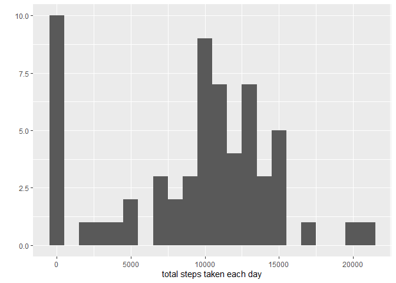
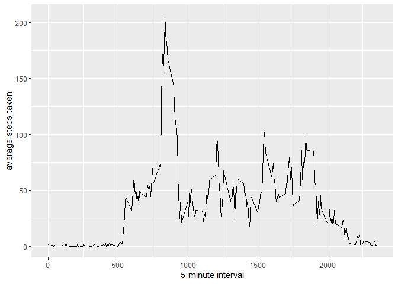
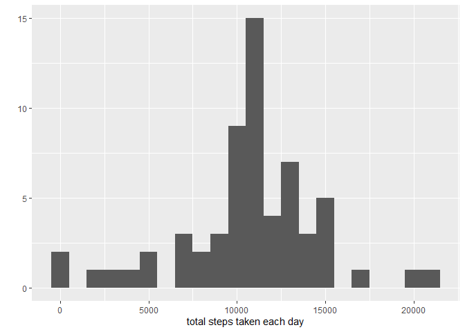

# Reproducible Research: Peer Assessment 1

## Loading and preprocessing the data

```r
data <- read.csv("activity.csv")
```

## What is mean total number of steps taken per day?

```r
library(ggplot2)
steps <- tapply(data$steps, data$date, FUN=sum, na.rm=TRUE)
qplot(steps, binwidth=1000, xlab="total steps taken each day")
```

<!-- -->

```r
mean(steps, na.rm=TRUE)
```

```
## [1] 9354.23
```

```r
median(steps, na.rm=TRUE)
```

```
## [1] 10395
```

## What is the average daily activity pattern?

```r
library(ggplot2)
averages <- aggregate(x=list(steps=data$steps), by=list(interval=data$interval),
                      FUN=mean, na.rm=TRUE)
ggplot(data=averages, aes(x=interval, y=steps)) +
    geom_line() +
    xlab("5-minute interval") +
    ylab("average steps taken")
```

<!-- -->

On average across all the days in the dataset, the 5-minute interval contains
the maximum number of steps?

```r
averages[which.max(averages$steps),]
```

```
##     interval    steps
## 104      835 206.1698
```

## Imputing missing values

```r
missing <- is.na(data$steps)
table(missing)
```

```
## missing
## FALSE  TRUE 
## 15264  2304
```

All of the missing values are filled in with mean value for that 5-minute
interval.


```r
fill.value <- function(steps, interval) {
    filled <- NA
    if (!is.na(steps))
        filled <- c(steps)
    else
        filled <- (averages[averages$interval==interval, "steps"])
    return(filled)
}
filled.data <- data
filled.data$steps <- mapply(fill.value, filled.data$steps, filled.data$interval)
```
using the filled data set, We  make a histogram of the total number of steps taken each day and also calculate the mean and median total number of steps.


```r
total.steps <- tapply(filled.data$steps, filled.data$date, FUN=sum)
qplot(total.steps, binwidth=1000, xlab="total steps taken each day")
```

<!-- -->

```r
mean(total.steps)
```

```
## [1] 10766.19
```

```r
median(total.steps)
```

```
## [1] 10766.19
```
We can observe that the Mean and median values are higher after imputing missing data.
This is because some days have step value as 0 for all intervals therefore making the total steps of that day equal to zero
## Are there differences in activity patterns between weekdays and weekends?
Using the filled in dataset we find the day of the week for every record 


```r
weekday.or.weekend <- function(date) {
    day <- weekdays(date)
    if (day %in% c("Monday", "Tuesday", "Wednesday", "Thursday", "Friday"))
        return("weekday")
    else if (day %in% c("Saturday", "Sunday"))
        return("weekend")
    else
        stop("invalid date")
}
filled.data$date <- as.Date(filled.data$date)
filled.data$day <- sapply(filled.data$date, FUN=weekday.or.weekend)
```

we make a panel containing plots of average number of steps taken
on weekdays and weekends.

```r
averages <- aggregate(steps ~ interval + day, data=filled.data, mean)
ggplot(averages, aes(interval, steps)) + geom_line() + facet_grid(day ~ .) +
    xlab("5-minute interval") + ylab("Number of steps")
```

<!-- -->
